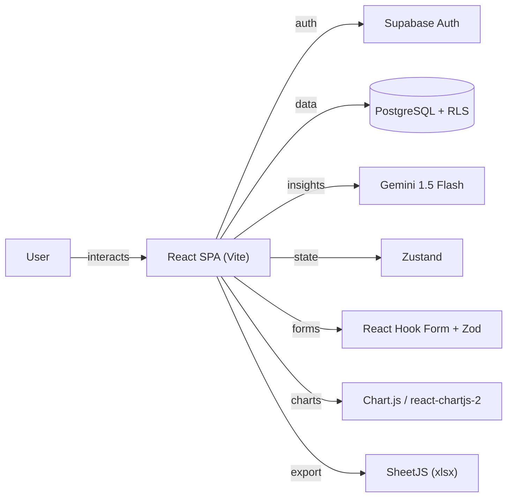

# Trackly

Modern finance tracker for budgeting, debt, insights, and spending habits.

## Overview

A modern finance tracker for budgeting, debt, insights, and spending habits. Built with React, Vite, Tailwind CSS, Supabase Auth, and Gemini 1.5 Flash for AI-powered financial insights and runway prediction.

## Core Architecture



## System Components

| Component | Responsibility |
|---|---|
| `src/` | React app shell, routing, state |
| `src/components/` | UI components for trackers, transactions, insights |
| `src/hooks/` | Custom hooks |
| `src/lib/` | Supabase client, utilities |

## Technology Stack

| Layer | Technology | Purpose |
|---|---|---|
| Frontend | React 18 + Vite | SPA framework |
| Styling | Tailwind CSS | Utility-first CSS |
| State | Zustand | Global state |
| Forms | React Hook Form + Zod | Form state and validation |
| Auth | Supabase Auth | Authentication and sessions |
| Database | Supabase Postgres + RLS | Data storage |
| AI | Gemini 1.5 Flash API | Financial insights |
| Charts | Chart.js / react-chartjs-2 | Spending visualization |
| Export | SheetJS (xlsx) | CSV and Excel export |
| i18n | i18next / react-i18next | Multi-language UI |
| PWA | Workbox | Offline shell |

## Requirements

- Node.js 18+
- npm
- Supabase project

## Configuration

| File | Purpose |
|---|---|
| `.env` | Supabase URL, anon key, Gemini API key |
| `vite.config.js` | Vite configuration |

## Getting Started

```bash
npm install
cp .env.example .env
# Configure Supabase and Gemini API keys
npm run dev
```

## Development

```bash
npm test          # Unit tests
npm run test:e2e  # Playwright E2E
npm run build     # Production build
```

## Keyboard Shortcuts

| Key | Action |
|---|---|
| `n` | Jump to new transaction section |
| `/` | Toggle transaction search |
| `t` | Open tracker switcher |
| `p` | Toggle privacy mode |
| `?` | Show shortcut help |
```
